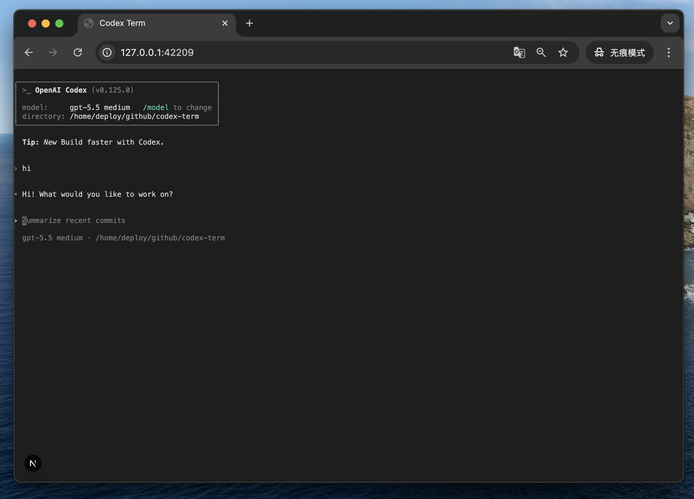

# codex-term

Run Codex CLI in your browser from any local directory.

```bash
cd /path/to/project
codex-term .
```

`codex-term` starts a local-only web terminal, opens your browser, and launches `codex` in the directory you pass in.



## Requirements

- Node.js 20+
- The Codex CLI available on your `PATH`

## Install

```bash
npm install -g codex-term
```

Or run from a local checkout:

```bash
pnpm install
pnpm dev
```

## Usage

```bash
codex-term [directory]
```

Examples:

```bash
codex-term .
codex-term ~/src/my-project
codex-term /absolute/path/to/project
```

The server binds to `127.0.0.1` by default and chooses a random available port. Keep the terminal process running while using Codex Term; press `Ctrl+C` to stop it.

## Options

```bash
codex-term --help
codex-term . --no-open
```

Environment variables:

- `HOST` - host to bind, defaults to `127.0.0.1`
- `PORT` - port to bind, defaults to `0` for a random available port

## Security

This tool runs Codex with the same local permissions as your shell. It is designed for local use and binds to `127.0.0.1` by default. Do not expose it to the public internet without authentication and isolation.

## License

Apache-2.0

## Third Party Notices

codex-term uses the following open source projects:

- [wterm](https://github.com/vercel-labs/wterm) (`@wterm/core`, `@wterm/dom`, `@wterm/react`) - Apache-2.0
- [node-pty](https://github.com/microsoft/node-pty) - MIT
- [Next.js](https://github.com/vercel/next.js) - MIT
- [React](https://github.com/facebook/react) - MIT
- [ws](https://github.com/websockets/ws) - MIT

codex-term is not affiliated with OpenAI or Vercel.

## Links

- X: [@iamai_omni](https://x.com/iamai_omni)
- Sponsored with tokens by [VibeShell](https://vibeshell.ai/)
